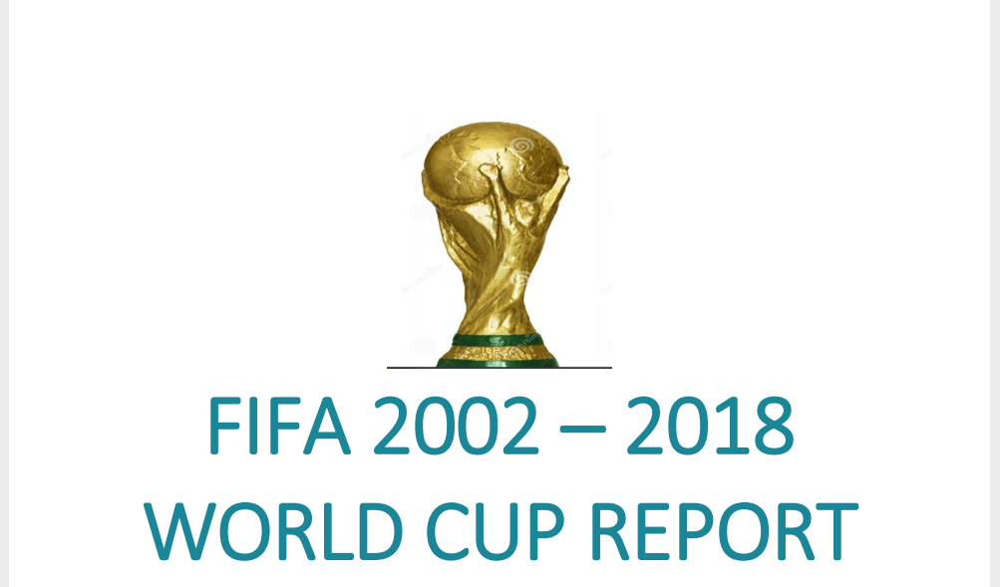
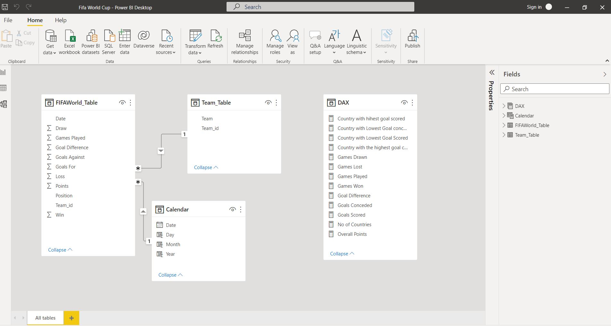
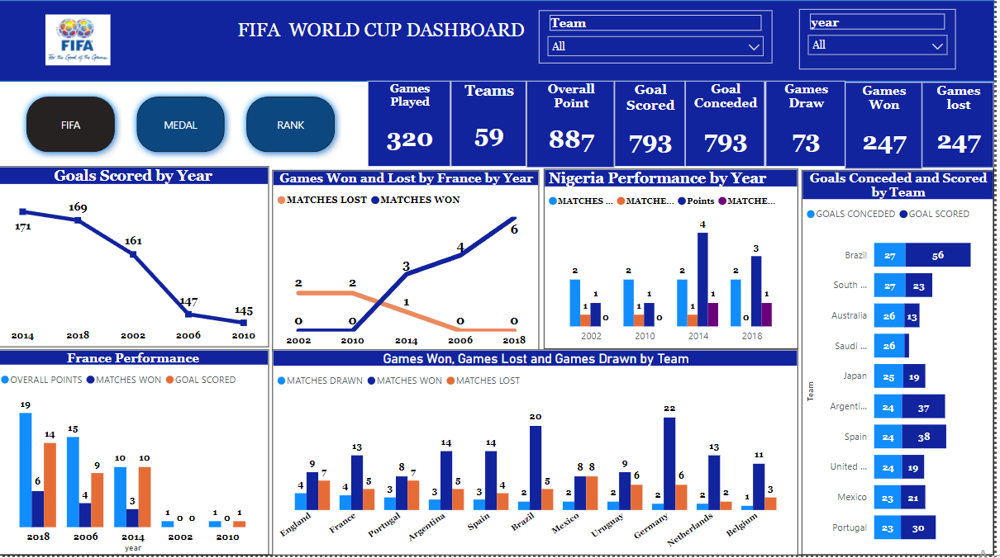
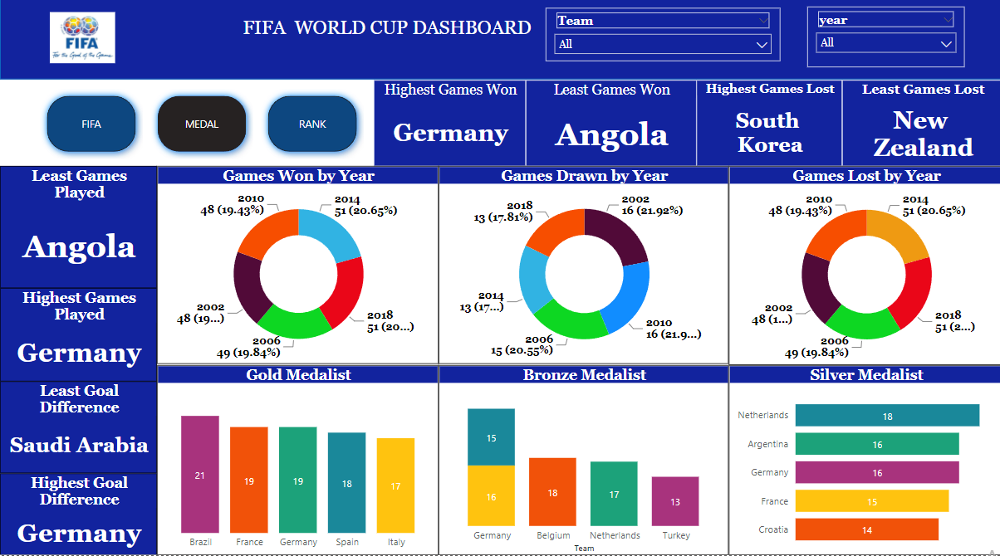
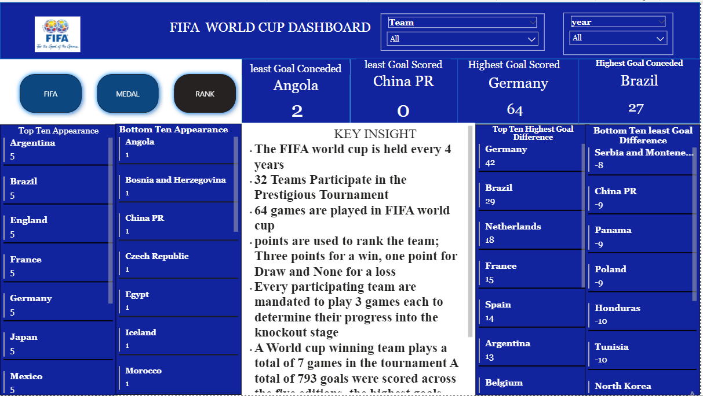

# FIFA-2002-2018-WORLD-CUP-REPORT

 
_ _ _

## Introduction 

This is a PowerBI project aimed at analyzing a dataset from the past 5 tournament of the **_FIFA World Cup tournament_**, which is the biggest international football competition in the world. The dataset includes information on 59 participating countries from different continents.The main objective of this project is to gain insights into the performance of these countries in the tournament and answer specific questions that will help in understanding their performance better.

## Problem Statement 

The following questions were asked to generate clear insight: 

How many countries participated in the FIFA World Cup tournament in the past 5 tournamnet?

What is the total number of games played in the tournament, including wins, losses, goals scored and conceded?

Which country had the highest and lowest number of appearances in the past five years?

Which country had the highest and lowest number of games played?

Which country had the highest and lowest number of games won?

Which country had the highest and lowest number of games lost?

Which country had the highest and lowest number of goals scored?

Which country had the highest and lowest number of goals conceded?

Which country had the highest and lowest goal difference?

Which country had the highest and lowest points?

## Skills/ Concepts demostrated: 
The following powerbi features were incoporated 
-Bookmarking,
- Dax functions
- Quick measures 
- Page navigation 
- Data Modelling 
- Filters 
- Tooltips 
- Button

## Findings 

In the given dataset, 59 countries played the FIFA world cup. 320 games were played, win and loss 
games were 247 games respectively and total goals were 793. 

The countries with the highest and lowest games played were; Germany played 13 games while 
Angola and 13 other countries played total games of 3 each. 

The countries with the highest and lowest games won were Germany and Angola with total games 
won in 5years as 22 and 0 respectively. 

The countries with the highest and lowest games lost were South Korea and Angola, 9 and 1 
respectively. 

The countries with the highest and lowest number of goals were Germany with 64 goals and Angola 
with 1 goal. 

Brazil has the highest number of goals against with a total number of 27 and Angola has the lowest 
goals-against against 2. 

Germany has the highest points of 69 while China PR has the lowest point of 0.

## Tailored Analysis

The total goal scored in the 5 years FIFA world cup dataset was 793 goals, of which; the highest and 
lowest goals was scored in 2014 and 2010 total goals of 171 and 145 respectively. 

However, in 2018, 2002, and 2006 goals scored were 169, 161, and 147 respectively. 

France got the most points in 2018 with a total of 19 points, most goals were scored in the same year 
with 14 goals, 6 games were won and 1 draw out of the 7 games played. 

In the last 5 years, France had downward and upward trends between 2002 and 2018. 

The downward trend in 2002 and 2010, out of the 3 games played in 2002, loss 2 and draw 1 while in 
2010, they played 3 games loss 2 and draw 1. In other words, they did not win any game in 2002 and 

The upward trend was in 2006, 2014, and 2018. In 2014, they played 5 games, won 3, lost 1, and also 
had a draw. While in 2006 and 2018 they played in 7 games, won 4 and 3 draws in 2006, and also 
won 6 games and a draw in 2018. 

Nigeria’s performance in the last 5 years; in 2002 and 2010 they played 3 games, won none of the 
matches, lost 2, and also had a draw. 

In 2014, they played 4 games, won 1, lost 2, and also had a draw. 

In 2018, they played 3 games. Won none, loss 2 and 1 draw. 

In 2006, Nigeria did not participate in the FIFA world cup.

## Analysis of countries that won and lost the world cup  between 2002 and 2018 
Brazil won the cup in 2002; they won all the 7 games played with a total of 21 points, a total of 18 
goals. However, the 5 teams that lost most were; China PR, Croatia, Ecuador, and France.

In 2006 Germany won the FIFA world cup, they won 5 games out of the 7 games played, lost 1 and 
also had a draw. They scored 14 goals with a total of 16 points. However, the 3 teams that lost most 
that are; underperformed teams were Costa Rica, Serbia & Montenegro, and Togo. 

In 2010, Netherland won the FIFA world cup. In all the 7 games played, they won 6 and lost 1 game 
with a total of 18 points. They scored 12 goals. Algeria, North Korea, and Cameroon had the most 
loss matches.

In 2014, Germany won the FIFA world cup for the second time after 2006. Out of the 7 games 
played, they won 6 and also had a draw with a total of 19 points. They scored 18 goals, higher than 
the total number of goals scored in 2006. Australia, Cameroon, and Honduras had the most loss 
matches. 

Finally, in 2018 France won the FIFA world cup. Out of the 7 games played, they won 6 games and 
lost 1 of the game with a total of 19 points and 16 goals scored. Egypt, England, and Panama had the 
most loss matches.

## Data Modelling 

Once the data was loaded into PowerBI, i started modeling the data by creating relationships between tables, creating calculated columns and measures, and creating visualizations.

The ERD Model is a star Schema. There are four tables showing the entity, realtionships and Dax .which are a fact table,two dimension tables and Dax tables showing all the calculations and functions. The dimension table are all join to the fact table with a one-to-many reltionship. 

## Visualization 

 The visualization comparies of the Dashbaords
 1. fifa Dashboard 
 2. Medal Dashboard 
 3. Rank Dashboard 

## Fifa Dashboard ⚽

## Medal Dashboard 🏅

## Rank Dashboard 🧘

## Conclusion:
In summary, this analysis of the FIFA World Cup dataset spanning 5 tournament has provided insights on the performance of different countries. We found that Germany had the highest games played, goals scored, and points accumulated, while Angola had the lowest performance in all categories. Additionally, we analyzed the performance of individual countries in each tournament year, identifying upward and downward trends for France and Nigeria.

## Recommendation:
To further enhance the analysis, future studies can consider incorporating additional variables such as player statistics, team rankings, and home advantage. Additionally, analyses can be done on specific matches to understand what factors led to the success or failure of particular teams.

